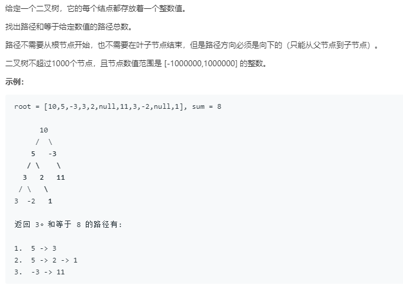

### 437.路径总和III


#### 暴力解法，双重递归
每个node都要计算以它作为起点往下是否有path --> 这是一层递归

在考虑当前点为起点往下有没有path的时候，它的path可以往左也可以往右，于是要综合考虑 --> 这是另一层递归

```
# Definition for a binary tree node.
# class TreeNode:
#     def __init__(self, x):
#         self.val = x
#         self.left = None
#         self.right = None

class Solution:
    def pathSum(self, root: TreeNode, sum: int) -> int:
        if not root:
            return 0
        return self.fromHead(root,sum)+self.pathSum(root.left,sum)+self.pathSum(root.right,sum)

    def fromHead(self,root:TreeNode,sum:int)->int:
        if not root:
            return 0
        sum-=root.val
        temp=1 if sum==0 else 0
        return temp+self.fromHead(root.left,sum)+self.fromHead(root.right,sum)
```

#### 单层递归，利用哈希表记录之前节点的累加值，时间复杂度O(n)

```
# Definition for a binary tree node.
# class TreeNode:
#     def __init__(self, x):
#         self.val = x
#         self.left = None
#         self.right = None

class Solution:
    def pathSum(self, root: TreeNode, sum: int) -> int:
        if not root:
            return 0
        prefixSum=0
        prefixTree={0:1}
        self.count=0
        self.dfs(root,prefixSum,prefixTree,sum)
        return self.count
    def dfs(self,root,prefixSum,prefixTree,sum):
        if not root:
            return 0
        prefixSum+=root.val
        oldSum=prefixSum-sum
        if oldSum in prefixTree:
            self.count+=prefixTree[oldSum]
        prefixTree[prefixSum]=prefixTree.get(prefixSum,0)+1
        self.dfs(root.left,prefixSum,prefixTree,sum)
        self.dfs(root.right,prefixSum,prefixTree,sum)
        prefixTree[prefixSum]-=1

        # 以下用于观察递归执行过程，即深度优先搜索
        # 亦可放在两个self.dfs之间观察输出
        for item in prefixTree.items():
            print(item)
        print('count=',self.count)
```
每次回到上一层，即当成递归结束后，从root到当前节点的prefixSum需要被删除，然后进入另一侧，避免路径被重复计算。

因此最后有prefixTree[prefixSum]-=1