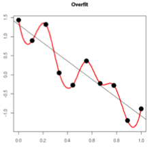
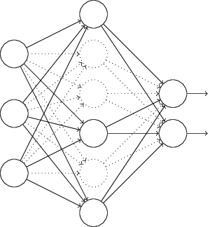

### 训练网络过拟合
**过拟合原因： 训练数据不足 、 训练过度**

防止过拟合的常用方式有：

#### 1. 提前终止，当验证集上的效果已经饱和，效果开始变差的时候终止训练。

#### 2. 数据增广

#### 3. 正则化

正则化方法是指在进行目标函数或代价函数优化时，在目标函数或代价函数后面加上一个正则项，一般有L1正则与L2正则。正则化的神经网络往往能够比非正则化的泛化能力更强，一般来说只需对w进行规范化，而几乎不对b进行正则化。

**L1 正则化**

$$ C=C_0+\frac{λ}{n}\sum_w|w| $$

在原始的代价函数后面加上一个L1正则化项，即所有权重w的绝对值的和，乘以λ/n，比原始的更新规则多出了 $η * λ * sgn(w)/n$ 这一项。当w为正时，更新后的w变小。当w为负时，更新后的w变大——因此它的效果就是让w往0靠，使网络中的权重尽可能为0，也就相当于减小了网络复杂度，防止过拟合。

**L2 正则化**
$$ C=C_0+\frac{λ}{2n}\sum_w|w^2| $$

所有参数w的平方的和，除以训练集的样本大小n。λ就是正则项系数，权衡正则项与C0项的比重。另外还有一个系数1/2，1/2经常会看到，主要是为了后面求导的结果方便，后面那一项求导会产生一个2，与1/2相乘刚好凑整。

总结：在L1正则化中，权重通过一个常量向0进行收缩；而L2正则化中，权重通过一个和w成比例的量进行收缩。所以，当一个特定的权重绝对值|w|很大时，L1规范化的权重缩小远比L2小很多；而当|w|很小时，L1规范化的缩小又比L2大很多。

更小的权值w，从某种意义上说，表示网络的复杂度更低，对数据的拟合刚刚好（这个法则也叫做奥卡姆剃刀），而在实际应用中，也验证了这一点，L2正则化的效果往往好于未经正则化的效果。（当然，对于很多人来说，这个解释似乎不那么显而易见，所以这里添加一个稍微数学一点的解释）：

过拟合的时候，拟合函数的系数往往非常大，为什么？如下图所示，过拟合，就是拟合函数需要顾忌每一个点，最终形成的拟合函数波动很大。在某些很小的区间里，函数值的变化很剧烈。这就意味着函数在某些小区间里的导数值（绝对值）非常大，由于自变量值可大可小，所以只有系数足够大，才能保证导数值很大。

而正则化是通过约束参数的范数使其不要太大，所以可以在一定程度上减少过拟合情况。

[参考文章1](https://www.cnblogs.com/lovephysics/p/7220703.html)
|[参考文章2](https://blog.csdn.net/crazy_scott/article/details/80343324)

#### 4. Droupout

L1/L2正则化是通过修改代价函数来实现的，而Droupout则是通过修改神经网络本身实现的，是训练网络时用的一种技巧。Droupout是指每次使用梯度下降时，只使用随机的一半神经元进行更新权值和偏置，因此最后训练得到的神经网络是在一半隐藏神经元被丢弃的情况下学习的。

运用了Droupout的训练过程，相当于训练了很多个只有半数隐层神经元的神经网络，每一个这样的半数网络，都可以给出一个分类结果，这些结果有的是正确的，有些是错误的。随着训练的进行，大部分半数网络都可以给出正确的分类结果，那么少数的错误分类结果就不会对最终结果造成大的影响。

#### 5. Batch Normalization 批标准化/规范化

在深度网络的中间层内添加正态标准化处理（作为 BN 层出现），同时约束网络在训练过程中自动调整该标准化的强度，从而加快训练速度并降低权值初始化的成本。
控制过拟合，可以少用或不用Dropout和正则；降低网络对初始化权重敏感；允许使用较大的学习率。