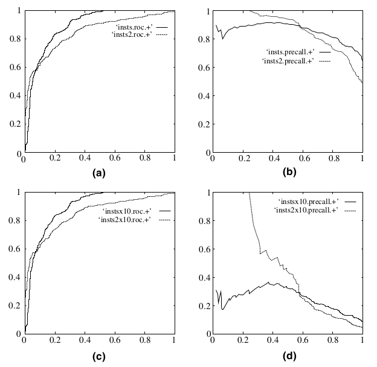

# 算法评价指标

#### 名词解释

|TP|FP|FN|TN|
|:---:|:---:|:---:|:---:|
|真正例|假正例|假负例|真负例|

TP —— True Positive（真正）被模型预测为正的正样本

FP —— False Positive （假正）被模型预测为正的负样本

TN —— True Negative（真负）被模型预测为负的负样本

FN —— False Negative（假负）被模型预测为负的正样本

### 1. 召回率

$$Recall=\frac{TP}{TP+FN} $$

### 2. 准确率
$$ Precision=\frac{TP}{TP+FP} $$

### 3. F-Measure（精确率和召回率的调和均值）

$$ F=\frac{(1+α^2)P*R}{α^2(P+R)}$$

当α=1时，即为最常见的F1指标，F1越大表明算法性能越好。

$$ F1=\frac{2*P*R}{P+R} $$

### 4. ROC曲线

ROC曲线描述召回率TPR随误检率FPR变化的曲线。特点：正负样本的分布失衡的时候，ROC曲线保持不变。

ROC曲线下方积分面积（AUC）越大，表明分类器性能越好；

虽然ROC曲线相比较于Precision和Recall等衡量指标更加合理，但是其在高不平衡数据条件下的的表现仍然过于理想，不能够很好的展示实际情况。

#### 如何绘制ROC曲线

假设已经得出一系列样本被划分为正类的概率，将Scores从高到低排序，并依次将Score值作为阈值threshold，当测试样本属于正样本的概率大于或等于这个threshold时，为正样本，否则为负样本。可以得到一组FPR和TPR，即ROC曲线上的一点。将它们画在ROC曲线的结果如下图：

### 5. PR曲线

描述准确率Precision随召回率Recall变化的曲线，绘制方法同ROC曲线。

和ROC曲线的对比：

正负样本的分布失衡的时候，ROC曲线保持不变，而PR曲线会产生很大的变化。(a)（b）分别是正反例相等的时候的ROC曲线和PR曲线,（c）（d）分别是负例：正例=10:1的ROC曲线和PR曲线

在正负失衡的情况下（负样本大于正样本），从ROC曲线看分类器的表现仍然较好（图c），然而从PR曲线来看，分类器就表现的很差。
